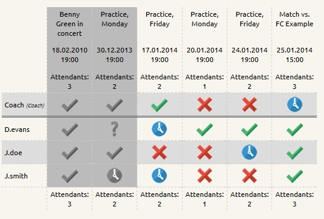

#sb_attendance
#### attendance extension for contao CMS

sb_attandance allowes you to manage attandance of members for calendar events

##### Please create new issues for feature you would like to be implemented as well as bugs you find. Thanks

#####It's my first contao extension, so please, help me by giving lots of feedback.

###Features:
- Assign a status for each event and member
- Display in frontend
- Modify status by clicking
- four different status options
- Extended rights for adminstrator and coach
- inactive members will not be displayed in list
- Lock time before an event
- show expired events' status
- total attendants per event
- Third status option can be disabled
- sorting choosable (by username, firstname, lastname, both)
- a member can be assigned as team captain
- multiple lists per installation possible
- coach can cancel events (incl. email notification for members)
- additional information displayable via hoverbox
- members can enter a reason for absence
- optional descriptions for coach, captain and attendants

